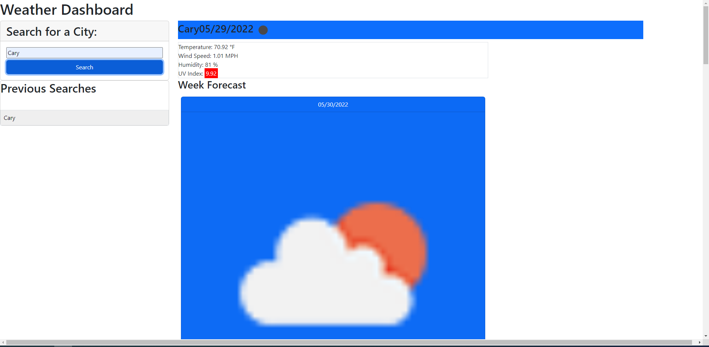

# weather-dashboard

# Purpose

Build a weather dashboard that wll run in the browser and feature dynamically updated HTML and CSS. This weather dashboard shows you the current day's weather as well as the weather for the upcoming week. It also saves previous cities you searched for as buttons that you can click to go look at those results again.

# Built With

- HTML
- CSS
- JavaScript
- LocalStorage
- Openweathermap API

## Image

# Website Repo

https://github.com/DanielCConlon/weather-dashboard

# GitHub Pages

https://danielcconlon.github.io/weather-dashboard/
